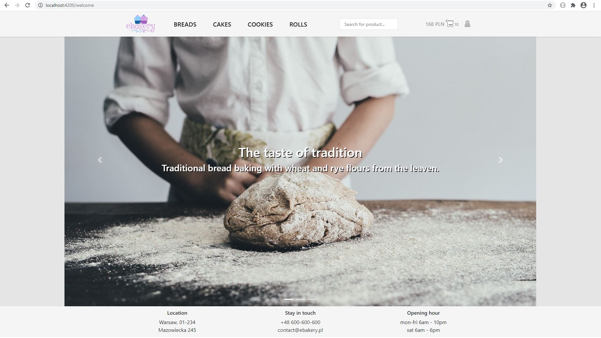
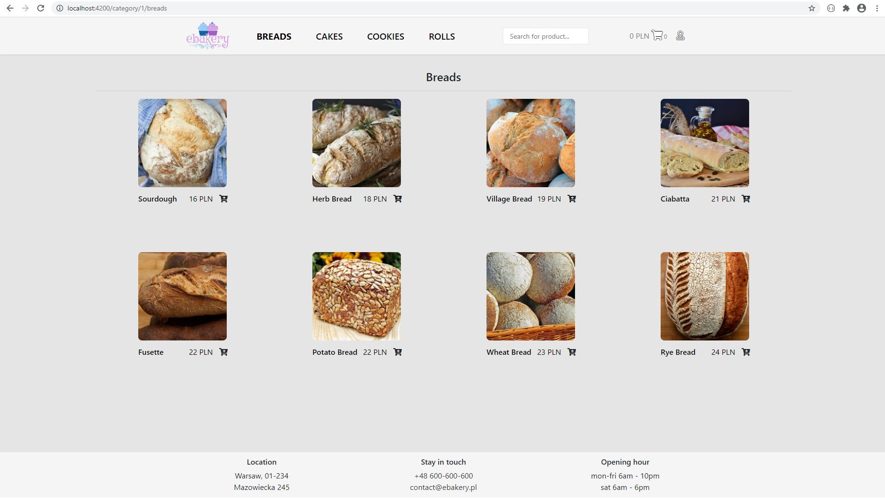
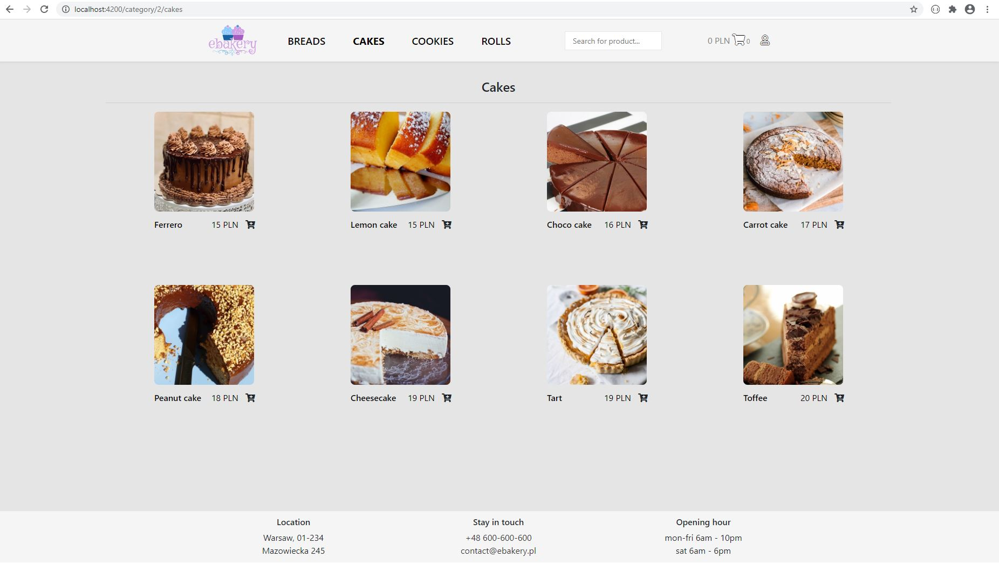
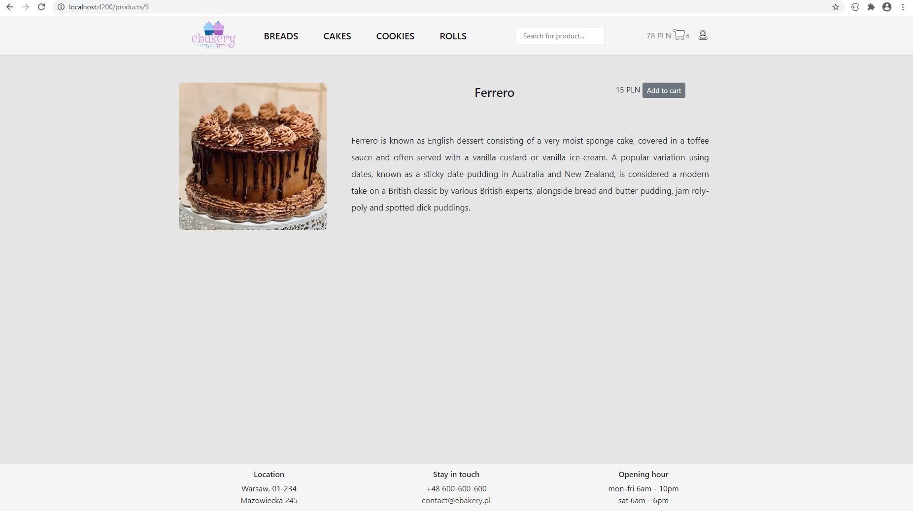
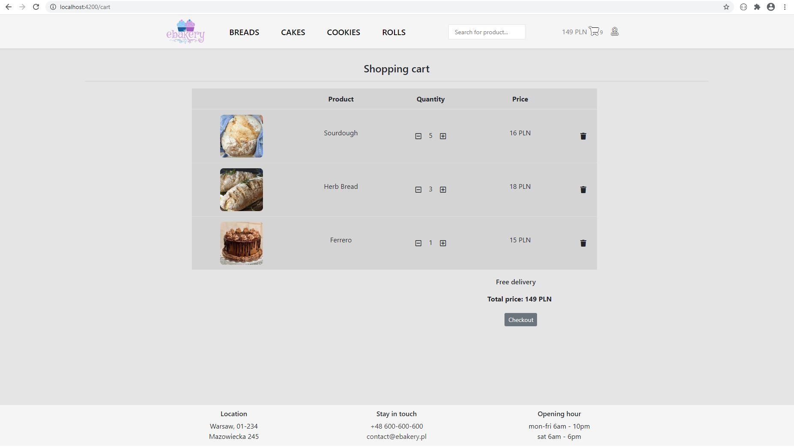
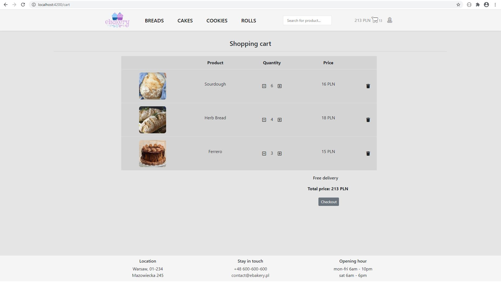
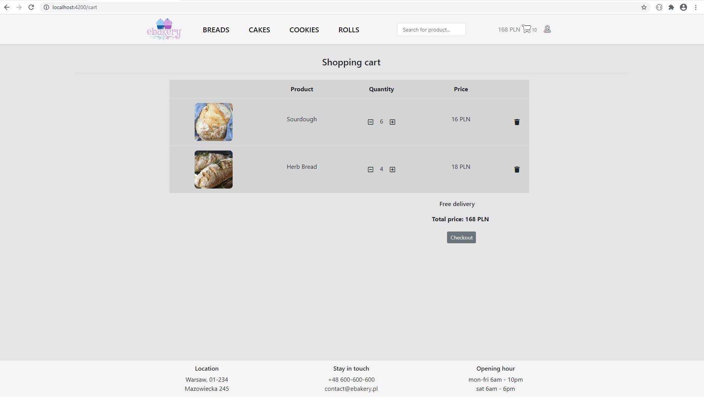
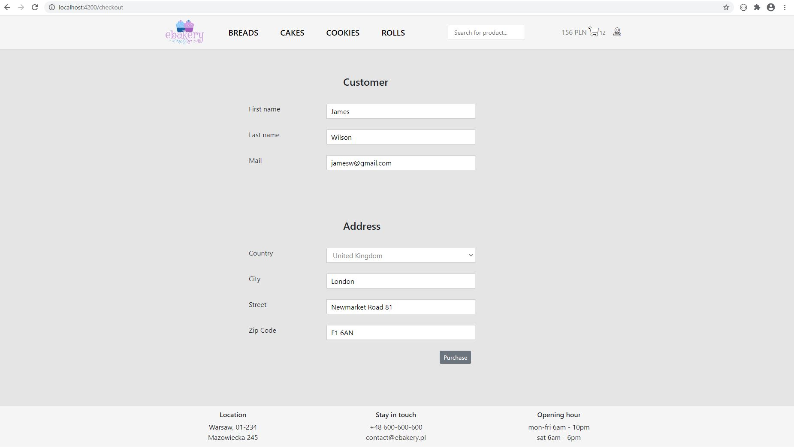
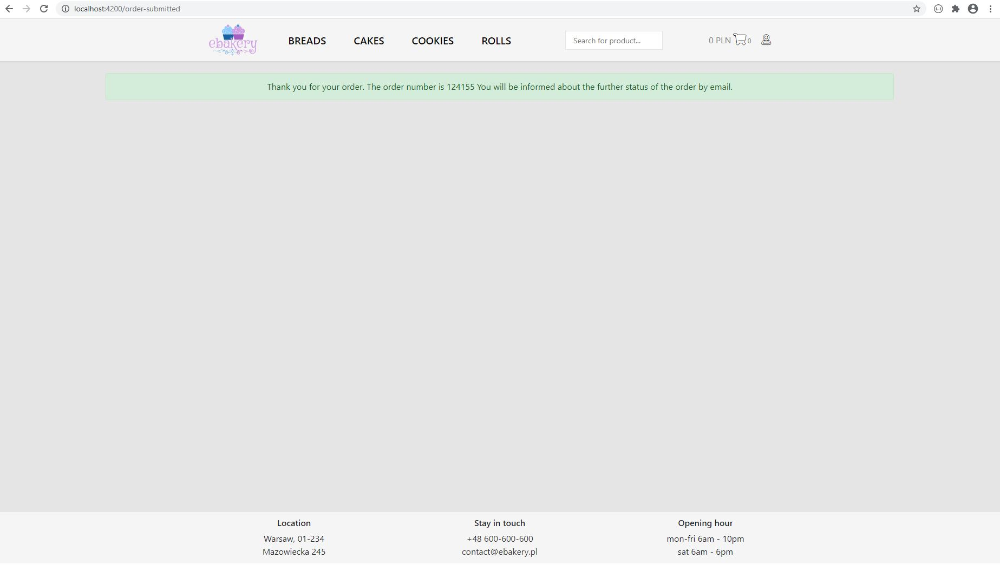

ebakery
---------------------------------------------
Ordering bakery products online

---------------------------------------------
##### This project contains technologies:
- Java 11
- Spring Boot 2.2.6
- Angular 9
- Ng-bootstrap 6.1
- Docker Compose 3.1
- JPA + Hibernate
- PostgreSQL 12
- Liquibase 3.8.5
- Maven 3.6.2
- Lombok 1.18.12

###### To run the application you need to install: Java JDK 11 Node.js, Docker
---------------------------------------------
##### Features:
- show list of products for each category
- show details of selected product
- search products by name
- add products to shopping cart
- change quantity or remove products from shopping cart
- check total price, quantity and products names for the order 
- generate order id and save the order in db

--------------------------------------------
#### How to run application:
Backend:
```
 # 1. Run the script that starts the PostgreSQL database via Docker Compose 

cd docker/dependencies

 # Linux / MacOS
./start.sh

 # On Windows
start.sh

 # 2. Run class EbakeryApplication
```

Frontend:
```
 # 1. Download all frontend dependencies by command

npm install

 # 2. Run frontend application 

npm start

 # 3. Navigate to http://localhost:4200/
```
---------------------------------------------
##### Screens:
Welcome page as ng-bootstrap carousel.


List of breads - user can add product to shopping cart by clicking on cart icon below picture of product.


List of cakes - another category of products (cookies and rolls are also available).


User can click on the product picture to read more details. The product can be added to shopping cart by clicking on 'Add to cart' button.


User can click on shopping cart icon in the upper right corner to check contents of the shopping cart.


Quantity can be changed by clicking on + or - icon. It will dynamically change the final price. 


Product can be removed by clicking on trash icon.


Checkout page.


Order confirmation.

